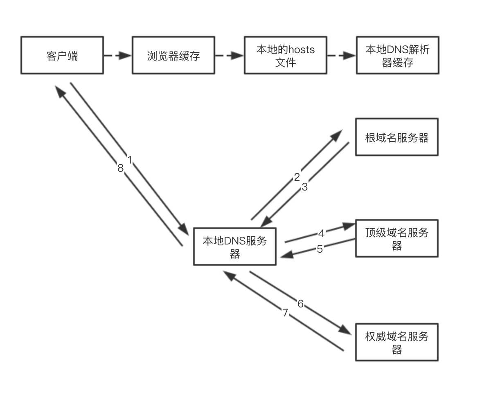
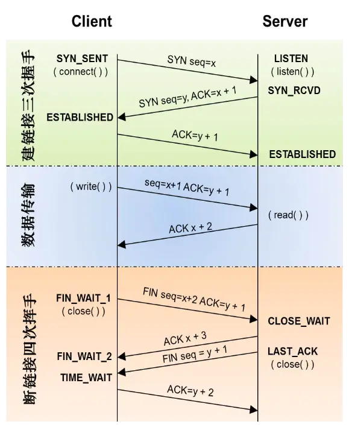

# 在浏览器输入URL后会发生什么

1. DNS查询
2. TCP连接
3. 发送HTTP请求，服务器处理请求，返回响应结果
4. 关闭TCP连接
5. 浏览器渲染

---

<!-- ## URL解析
首先判断你输入的是一个合法的 URL 还是一个待搜索的关键词，并且根据你输入的内容进行自动完成、字符编码等操作。

--- -->

## DNS查询

<!-- 递归查找
任何一步找到都会结束查找流程 -->
<!-- 迭代查询 -->

---

## TCP的连接和关闭
三次握手  
四次挥手  

---

## 发送HTTP请求，服务器处理请求，返回响应结果
浏览器向服务器发送 http 请求，如果服务器段返回为200，则   301 之类的重定向，浏览器根据相应头中的 location 再次发送请求

服务器端接受请求，处理请求生成 html 代码，返回给浏览器，这时的 html 页面代码可能是经过压缩的

---

## 浏览器渲染

<!-- HTML -->
<!-- CSS -->
<!-- 构建 DOM 树: 
解码、预解析、符号化、构建树
将 HTML 转化为指定的编码字符，再根据 HTML 规范 转换为各种标签，解析成树状的对象标签，DOM树 -->
<!-- 样式计算：将css样式计算为浏览器可以理解的styleSheets，css从有往左计算，使用class，不过度层叠 -->
<!-- 页面布局：排除功能化、非视觉节点和 display:none 的节点，计算元素的位置信息，确定元素的位置，构建一棵只包含可见元素布局树 -->
<!-- 分层树：复杂的 3D 变换、页面滚动，或者使用 z-indexing 做 z 轴排序 -->

<!-- CSS 会阻塞 JS 执行
JS 会阻塞后面的 DOM 解析 -->

<!-- JS 词法分析 预编译、执行 -->
